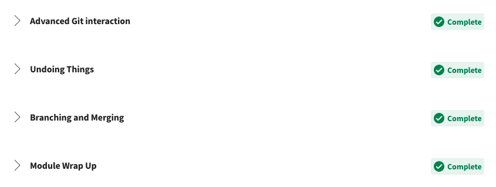
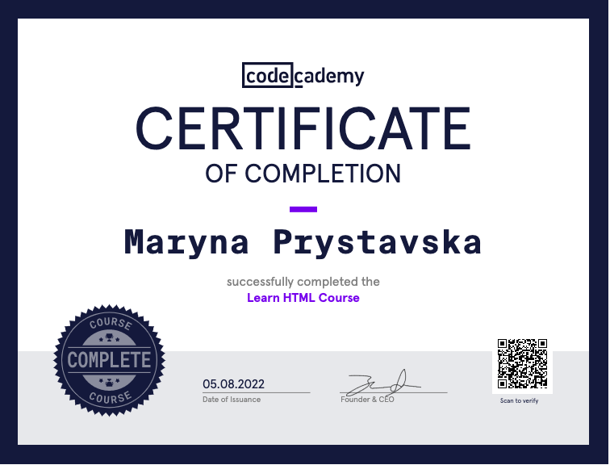

# kottans-frontend
This repo reflects the process and results of the Front-End course completion.

## General
- [X] 0. [Git Basic](#0-git-basic)
- [X] 1. [Linux CLI, and HTTP](#1-linux-cli-and-http)
- [X] 2. [VCS, GitHub and Collaborating](#2-git-collaboration)

## Front-End Basic
- [X] 3. [Intro to HTML & CSS](#3-intro-to-html-and-css)
- [ ] 4. [Responsive Web Design](#4-responsive-web-design)
- [ ] 5. HTML & CSS Practice
- [ ] 6. JavaScipt Basics
- [ ] 7. Document Object Model

## Advansed Topics
- [ ] 8. Building a Tiny JS World
- [ ] 9. Object oriented JS
- [ ] 10. OOP exercise
- [ ] 11. Offline Web Applications
- [ ] 12. Memory pair game
- [ ] 13. Website Perfomance Optimization
- [ ] 14. Friends APP

## 0. Git Basic
###  _Coursera course_
 [Introduction to Git and GitHub](https://www.coursera.org/learn/introduction-git-github)

- [X] Finish the first week of course.

Coursera git 1 week

 

- [X] Finish the second week of course.
>skipping the staging area, amending commits, rollbacks, git reset, git revert, branches and merging.
>Need more read and practise with merge conflicts

Coursera git 2 week

  

### _learnGitBranch_
[learngitbranching.js.org](https://learngitbranching.js.org/)

- [X] Complete "Introduction Sequence".

Introduction Sequence

 
  

- [X] Complete "Push & Pull -- Git Remotes!".
> git pull --rebase; git push

Push & Pull -- Git Remotes!

  

- [X] Send pull-request here [Kottans/mock-repo ](https://github.com/Kottans/mock-repo)

## 1. Linux CLI, and HTTP
### _Linux Survival_

- [X] Linux survival Quiz 1.
>The "more" command is used to view the contents of a file. The command to create a directory is "mkdir" which is short for "make directory". 
>To move a file, you just use the "mv" command. Renaming files is simply a case of "moving" a file from one name to another. To change directories, use the "cd" command. Wherever you see "..", it refers to the directory above your current directory.

Linux survival Quiz 1

  

- [X] Linux survival Quiz 2.
> The copy command is "cp". The "remove directory" command is "rmdir".

> Deciphering the security characters will take a bit more work. The 'r' means you can "read" the file's contents.
The 'w' means you can "write", or modify, the file's contents.
The 'x' means you can "execute" the file. This permission is given only if the file is a program.
If any of the "rwx" characters is replaced by a '-', then that permission has been revoked.

> To change the security permissions on files - "chmod".

Linux survival Quiz 2

  

- [X] Linux survival Quiz 3.
> The "man" command. 'man -k'. 'man finger'. 'find'. 'lpr' - send to printer. 'lpq' - display print queue. 'lprm' - remove from print queue. The '-P' stands for "printer". (lpr -P printer_name file_name). 'finger' - show user information. '.' - current directory.

Linux survival Quiz 3

  

- [X] Linux survival Quiz 4.
> "df" - to see how much disk space. The command that allows you to remove an entire directory tree is "rm -r". The command used to examine running programs (or "processes", in Linux lingo) is "ps", which stands for "process status".  "ps aux". The "|" sends the output of a command as the input to another command.You can use "grep" to find patterns in data. " kill PID". "kill -9 PID" - kill immediately. 

Linux survival Quiz 4

  

 - [X] [HTTP: Протокол, який повинен розуміти кожний веб-розробник - Частина 1](https://code.tutsplus.com/uk/tutorials/http-the-protocol-every-web-developer-must-know-part-1--net-31177)

 - [X] [HTTP: Протокол, який повинен розуміти кожний веб-розробник - Частина 2](https://code.tutsplus.com/uk/tutorials/http-the-protocol-every-web-developer-must-know-part-2--net-31155)

## 2. Git Collaboration

- [X] Finish the third week of course.

Coursera week 3

  

- [X] Finish the fourth week of course.

Coursera week 4

  

- [X] Complete "Moving Work Around", "A Mixed Bag".

>> Git describe має наступну форму: git describe <посилання>.
>>Де <посилання> -- це будь-що, що вказує на конкретний коміт. Якщо ти не вкажеш посилання, git використає поточну локацію (HEAD).
>>Вивід команди виглядає як:
>><таг>_<к-ть комітів>_g<хеш>
>>де таг -- це найближчий попередній таг з історії; к-ть комітів -- це наскільки далеко цей таг в історії, а <хеш> -- це хеш коміту, який описується.

learnGitBranch 1

  

- [X] Complete "To Origin And Beyond -- Advanced Git Remotes!".
> Що буде, якщо спробувати запушити "ніщо" у гілку віддаленого репозиторію? Git її видалить! Завантаження "нічого" в локальний репозиторій створює нову гілку.

learnGitBranch 2

  

## 3. Intro to HTML and CSS
### _Coursera_

- [X] Complete weeks 1 and 2 (up to Introduction to Responsive Design) course [Intro to HTML & CSS](https://www.coursera.org/learn/html-css-javascript-for-web-developers)

Coursera week 1

  

Coursera week 2

  

### _Learn HTML_

- [X] [Learn HTML(Eng)](https://www.codecademy.com/learn/learn-html)

Codecademy HTML

  

### _Learn CSS_

- [X] [Learn CSS(Eng)](https://www.codecademy.com/learn/learn-css)

Codecademy CSS

  

## 4. Responsive Web Design

- [X] [Responsive web design basics](https://web.dev/i18n/en/responsive-web-design-basics/)
> A meta viewport tag gives the browser instructions on how to control the page's dimensions and scaling. Using the meta viewport value width=device-width instructs the page to match the screen's width in device-independent pixels. 

> Adding the value initial-scale=1 instructs browsers to establish a 1:1 relationship between CSS pixels and device-independent pixels regardless of device orientation, and allows the page to take advantage of the full landscape width.

> Flexbox. This layout method is ideal when you have a set of items of different sizes and you would like them to fit comfortably in a row or rows, with smaller items taking less space and larger ones getting more space.

> CSS Grid Layout allows for the straightforward creation of flexible grids. If we consider the earlier floated example, rather than creating our columns with percentages, we could use grid layout and the fr unit, which represents a portion of the available space in the container.

> For some types of layout you can use Multiple-column Layout (Multicol), which can create responsive numbers of columns with the column-width property. 

- [X] [FLEXBOX. Вчимося верстати на флексах](https://www.youtube.com/playlist?list=PLM6XATa8CAG5mPV60dMmjMRrHVW4LmV2x)

- [X] [Flexbox Froggy](http://flexboxfroggy.com/) - гра для закріплення

Froggy Game

  

- [ ] [CSS Grid Layout](https://www.youtube.com/watch?v=GV92IdMGFfA&list=PLM6XATa8CAG5pXQrW_kDaeZb_uIAMNZIm)

- [ ] [Grid Garden](http://cssgridgarden.com/) - гра для закріплення

